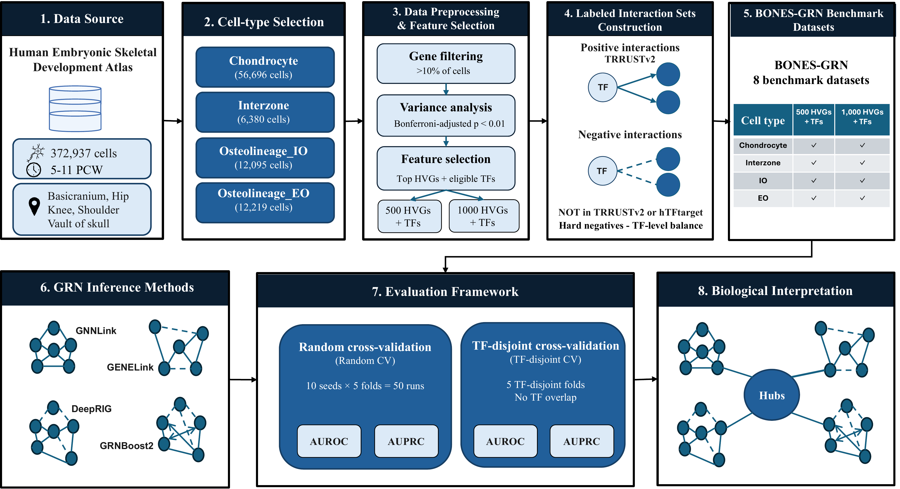

# BONES-GRN

## A Systematic Benchmark of Gene Regulatory Network Inference in Human Embryonic Skeletal Development

**BONES-GRN** is a systematic benchmarking study of gene regulatory network (GRN) inference methods using single-cell RNA-sequencing data from human embryonic skeletal development.

The study provides a fair and consistent evaluation of GRN inference across distinct skeletal cell populations under both transductive and inductive evaluation settings.

---

## Study Overview

The BONES-GRN framework comprises dataset preparation from human embryonic skeletal development single-cell transcriptomic data, standardized GRN inference, transductive and inductive evaluation, and downstream biological interpretation.

---

## Datasets

The benchmark is constructed from single-cell transcriptomic data from the Human Embryonic Skeletal Development atlas.

The study includes **87,390 cells** across four cell populations:

| Cell population | Cells |
| --- | ---: |
| Chondrocyte | 56,696 |
| Interzone | 6,380 |
| Osteolineage – Intramembranous Ossification (IO) | 12,095 |
| Osteolineage – Endochondral Ossification (EO) | 12,219 |

The cells span five anatomical regions:

- Calvaria
- Hip
- Knee
- Shoulder
- Skull base

Two gene-set configurations are considered for each cell population:

- 500 highly variable genes (HVGs)
- 1,000 highly variable genes (HVGs)

This results in **eight benchmark datasets**.

---

## Benchmark Framework

BONES-GRN evaluates four GRN inference methods:

- GENELink
- GNNLink
- DeepRIG
- GRNBoost2

A topology-based **DegreeBaseline** is additionally included as a reference in the transductive evaluation.

Two complementary evaluation settings are considered.

### Transductive Evaluation

Random cross-validation is performed using **10 independent random seeds and five folds per seed**, resulting in 50 evaluations for each dataset.

### Inductive Evaluation

TF-disjoint cross-validation evaluates generalization to unseen regulators. Transcription factors appearing in each test fold are excluded from the corresponding training fold.

Five TF-disjoint folds are evaluated for each dataset.

---

## Evaluation Metrics

Performance is assessed using:

- AUROC
- AUPRC
- Runtime
- Memory consumption

The same predefined benchmark partitions are used across the evaluated methods to support a fair and consistent comparison.

---

## Data and Regulatory Interactions

Positive regulatory interactions are derived from **TRRUST v2**.

Negative interactions are selected from candidate TF–target pairs that are not documented as regulatory interactions in either **TRRUST v2** or **hTFtarget**, reducing the likelihood of treating known regulatory interactions as negatives.

The benchmark uses cell-population-specific expression profiles together with standardized regulatory interaction sets to evaluate GRN inference across human embryonic skeletal development.

---

## Availability

This repository serves as the public project page for the **BONES-GRN** study.

The **source code and implementation, processed benchmark datasets, predefined cross-validation splits, and supporting resources are not publicly available during the review process** and will be made publicly available following acceptance/publication of the manuscript.

---

## Citation

Citation information will be added following publication.
